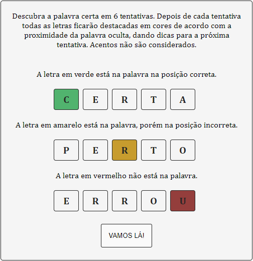
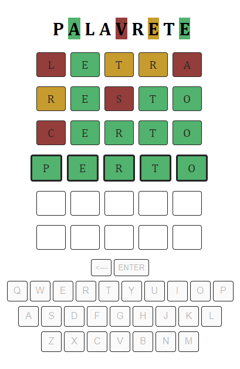

<h1 align="center">
  
  <p>Try to discovery the secret word!</p>
</h1>


## 👁‍🗨 Preview




## 📗 About

**Palavrete** is a word game that the player have to discover a secret word.


## 🎮 Running

Install dependencies:
````bash
$ npm install
````

Run the project:
````bash
$ npm start
````

Open in browser: http://localhost:3000/


## 🎲 Rules

The player has six tries to discover the secret word generated automatically by the game. When the enter button is hit with the written word, the pointer goes to the next line. The letter colors of the last word written will change according to the hits, giving tips for the next round until the word is guessed.